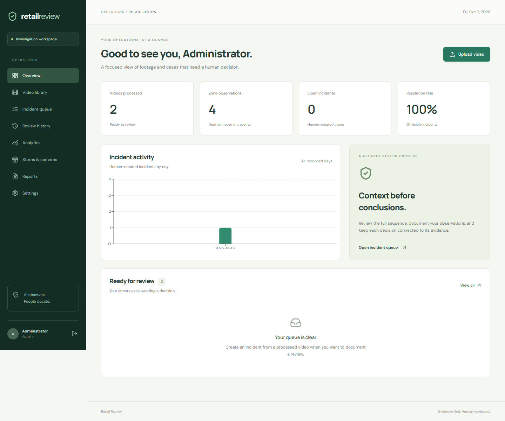
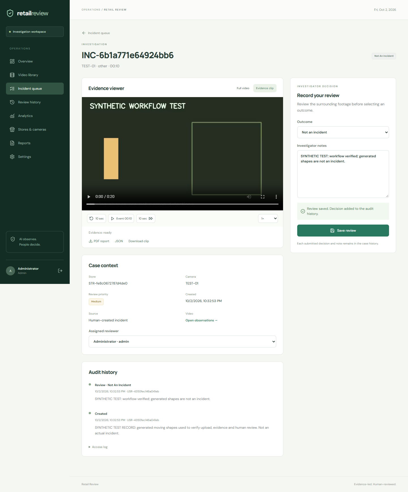

# Retail Review
### AI-assisted retail video investigation, with human decisions

A working full-stack application for uploading store video, detecting/tracking people, recording neutral zone observations, generating evidence and documenting investigator decisions. React + FastAPI + MongoDB + OpenCV/YOLO + Docker.

**Scope:** AI creates observations, never criminal-risk scores or automatic incidents. Humans create, prioritize, classify and escalate cases after reviewing evidence. No facial recognition, identity matching, crime prediction or automated theft determination. Uploaded footage is processed locally; direct CCTV/RTSP streaming is not part of this release.

## Quick start — Docker (recommended)

Install Docker Desktop with Linux containers and Docker Compose. Allow several GB of free disk space for Python, CPU PyTorch, the database and your videos. The first build downloads dependencies, and the first tracking run downloads a small pretrained model.

1. Extract this project and open a terminal in `retail-loss-prevention`.
2. Create `.env` using `python scripts/configure.py`. It prompts for an admin email/password and generates a secret. If Python is unavailable, copy `.env.example` to `.env` and replace the JWT secret (32+ random characters), admin email and password (12+ characters). Never commit `.env`.
3. Run:

```sh
docker compose up --build -d
```

4. Open **http://localhost:8080** and sign in with the credentials you configured.
5. Add a store/camera, upload a video, configure zones and choose **Start processing**.

```sh
docker compose logs -f backend worker
docker compose down
```

`down` preserves the named database/media volumes. Do not add `-v` unless you intend to delete all stored records and footage.

## What works

- JWT cookie login, Argon2 password hashing, three roles, account disablement.
- Store/camera administration and incident assignment.
- Validated video upload (MP4/MOV/AVI/MKV, 500 MB, one hour, up to 4K).
- Background jobs with persisted status/progress and visible failures.
- H.264 browser playback with seeking, ±10 seconds and speed controls.
- YOLO person detection, ByteTrack IDs local to each video, annotated video.
- Configurable rectangular zones, neutral entry/exit observation timeline.
- Human incident creation with category, timestamp, priority and notes.
- Automatically generated evidence clip and screenshot for each human-created case.
- Incident search and status/category/store/camera/date/assignee filters.
- Review decisions, immutable embedded history and separate access audit.
- Concurrent edit protection with explicit version conflicts.
- Live database-backed KPI/chart pages (not fabricated counters).
- PDF/JSON case reports, CSV export and Python/SQLite/Power BI integration.
- Docker Compose, automated tests and GitHub Actions CI.

## Architecture

```text
React browser → Nginx → FastAPI → MongoDB
                         ↓          ↓ queued jobs
                   private media ← Python worker
                                   FFmpeg → YOLO + ByteTrack → zone observations

Human reviews footage → creates incident → evidence clip → decision + history → reports
```

Read [Architecture](docs/architecture.md), [User guide](docs/user-guide.md), [API reference](docs/api.md) and [Power BI guide](analytics/power-bi.md).

## Local development without Docker

Requirements: Python 3.12, Node.js 22.12+, MongoDB 8, FFmpeg/ffprobe on PATH. Install the Python dependencies inside a virtual environment. FFmpeg must support libx264. Windows users can run these commands from PowerShell; macOS/Linux activation is shown as an alternative.

```sh
python -m venv .venv
# Windows:
.venv\Scripts\activate
# macOS / Linux:
# source .venv/bin/activate
python scripts/configure.py
pip install torch==2.7.0 torchvision==0.22.0 --index-url https://download.pytorch.org/whl/cpu
pip install -r backend/requirements-cv.txt
```

Edit the root `.env` for local development:

```dotenv
MONGODB_URI=mongodb://127.0.0.1:27017
APP_ORIGIN=http://localhost:5173
DATA_DIR=runtime
```

Keep these terminals open **from the repository root**:

```sh
# Terminal 1 (Python environment activated)
python -m uvicorn app.main:app --app-dir backend --host 127.0.0.1 --port 8000

# Terminal 2 (Python environment activated)
python scripts/run_worker.py

# Terminal 3
cd frontend
npm ci
npm run dev
```

Visit http://localhost:5173. The same-origin Vite proxy sends API calls to port 8000. The API docs are http://localhost:8000/api/docs in local development, and http://localhost:8080/api/docs under Docker.

Set `CV_ENABLED=false` to use upload, conversion, human review and evidence generation without YOLO. In that mode only `backend/requirements.txt` is needed. The CV checkbox will be disabled, and the application will not pretend detection ran.

## Try the complete workflow

Use authorized, staged footage with a person entering a marked area to exercise tracking. For a small **synthetic upload/playback-only test**:

```sh
python scripts/create_staged_video.py
```

Upload `runtime/staged-motion.avi` and disable tracking (the clip contains moving rectangles, not real people). Process it, choose a timestamp, create an incident with synthetic-test notes, review the evidence, mark **Not an incident**, then inspect Analytics and the PDF report. No synthetic data is inserted into your database automatically.

## Tests

```sh
pip install -r backend/requirements-test.txt
pytest tests -q
cd frontend
npm ci
npm test
npm run build
```

The backend suite uses an isolated MongoDB test double for API tests and real OpenCV/FFmpeg for the media integration test. That media test is skipped if FFmpeg/ffprobe is unavailable. See [Verification](docs/verification.md) for the separately executed live MongoDB, YOLO and browser smoke checks and their limitations.

## GitHub upload

Create an empty repository in your GitHub account, then from the extracted project:

```sh
git init
git add .
git commit -m "Build retail video investigation workspace"
git branch -M main
git remote add origin https://github.com/YOUR-USERNAME/retail-loss-prevention.git
git push -u origin main
```

Replace `YOUR-USERNAME` with your own account. The ZIP includes source, tests, Docker files, lockfile and documentation. It excludes passwords, real videos, model weights, node_modules and database files. Verify `git status` before publishing. This package has not been pushed to a repository on your behalf.

GitHub hosts the repository; it does not run the Python worker and database. GitHub Pages alone cannot host this application. Follow the [GitHub and HTTPS deployment guide](docs/deployment.md) to run the containers on a Docker server with the included Caddy HTTPS overlay.

## Screenshots

Screenshots in `docs/screenshots` were captured from the running application with clearly labeled test records.




## Limits and next steps

This is a runnable local/portfolio release, not a field-validated loss detector. The pretrained detector identifies people; reliable products/carts/scan matching would require suitable data, testing and external scan signals. This version does not include POS integration, a completed cloud deployment, a .pbix file, RTSP ingestion, multi-camera matching, GPU deployment, password reset emails, automatic retention or multi-tenant isolation. It intentionally omits criminality predictions.

Video sessions use a single processing worker, capped event output and a one-hour upload limit. Tracking IDs can change after occlusion. Automated observations are descriptive only. Test coverage does not establish real-world detection accuracy. Use synthetic/staged or appropriately authorized footage.

## Upstream licenses

Third-party dependencies and YOLO weights retain their own licenses. Read [Ultralytics licensing](https://www.ultralytics.com/license) before choosing distribution/commercial terms. No third-party weights or example photos are included in this ZIP.
