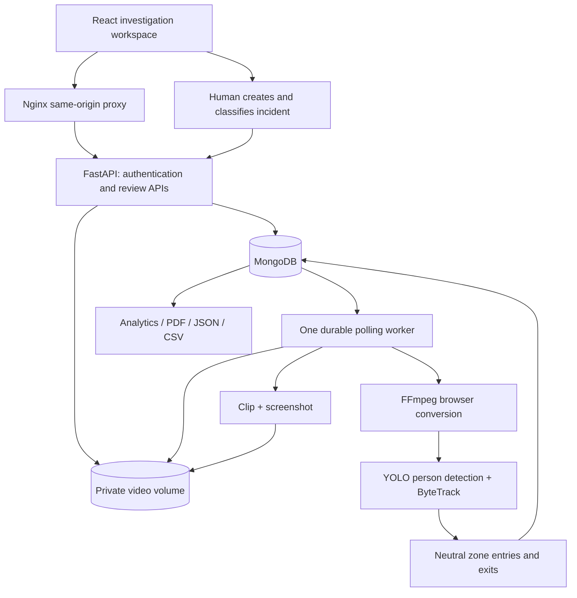

# Architecture and implementation notes

## Data and jobs

MongoDB holds users, stores, videos, events, incidents and access audits. Each incident embeds a versioned decision history; this intentionally replaces a separately writable investigations collection so each decision and its history are atomic. `/api/investigations` is a view over reviewed incidents.

Uploads are held in UPLOADED until the user has chosen zones and tracking options. The worker claims QUEUED records atomically, normalizes the video to H.264/15 fps/max 1280px width, then optionally samples every third normalized frame. At default settings this is 5 inference frames per second. ByteTrack IDs exist only in that video. The bottom-center of a person box is tested against normalized rectangles. Enter/leave observations are recorded; tracking loss is not falsely treated as a physical exit. No observations imply scan success, missing payment, identity, or criminal behavior. The event cap is 10,000 per video.

Evidence jobs use a timestamp chosen by a human, with up to 10 seconds on each side, clipped to video boundaries. Clips contain original unannotated footage. The API streams original/processed media with range support and checks authentication. Upload filenames are never used as disk paths.

Only one worker is supported. Restarting it marks interrupted analysis as FAILED (explicit retry) and returns interrupted evidence work to the queue. Queued records survive restarts. Scale-out workers, distributed leases, multi-camera identity, direct RTSP ingestion and POS scan integration are not implemented.

## Roles

All authenticated users can view the shared video library and stores. Admins manage users, stores/cameras and assignment. Reviewers can review all incidents. Investigators can access incidents assigned to them or created by them; this filter applies to details, evidence, reports, lists, review history and incident analytics. Video/event totals describe the shared library, while case totals reflect access scope. There is no per-store tenancy boundary in this version.

## Security boundaries

Argon2 password hashes; expiring HS256 JWT in HttpOnly SameSite=Strict cookies; origin checking on mutations; database-backed account disablement; basic in-process login throttling; no public media directory; no frontend secrets. Media must be backed up along with MongoDB.

Docker binds only the frontend to 127.0.0.1. MongoDB and the API have no public host ports. For a public deployment add TLS, secure cookies, authenticated database access, per-tenant scope, durable shared rate limiting, backups, retention/deletion policies, resource quotas and centralized monitoring. The included configuration is a local/portfolio deployment, not a turnkey hosted production service.

## Upstream references

- [Ultralytics tracking](https://docs.ultralytics.com/modes/track/)
- [FastAPI authentication](https://fastapi.tiangolo.com/tutorial/security/oauth2-jwt/)
- [MongoDB documentation](https://www.mongodb.com/docs/)

Ultralytics code/models have their own licensing terms. Check [Ultralytics licensing](https://www.ultralytics.com/license) before distributing or deploying a derivative commercially. Model weights are downloaded on first tracking run and are not bundled in this repository.
