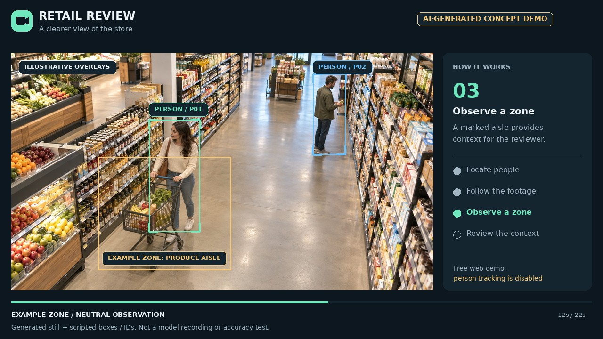

# Retail Review concept video

[](retail-review-concept.mp4)

**[Watch / download the MP4](retail-review-concept.mp4)**

The 22-second, 1280 × 720 H.264 video introduces the intended investigation
workflow using a realistic fictional supermarket scene. It is silent and uses
on-screen captions, so visitors can understand it without sound.

## What the animation illustrates

| Video time | Concept |
| --- | --- |
| 00:00–00:02 | Introduction to footage review |
| 00:02–00:06 | Person bounding boxes |
| 00:06–00:10 | IDs scoped to one video, without identity matching |
| 00:10–00:14 | A marked produce-aisle zone |
| 00:14–00:18 | Human review of context |
| 00:18–00:22 | Explore the code and run the full local setup |

**The source is one AI-generated still image.** Camera motion, boxes, IDs,
zone highlights and panel transitions are scripted by the renderer. The
shoppers do not move; no detector or tracker produced these annotations.
No confidence scores, measured accuracy or real incidents are shown.
This is neither a recorded application session nor a demonstration that the
free hosted app runs detection. The footer makes this distinction throughout.

The people in this fictional scene are ordinary shoppers. Being in a zone is
context for a reviewer and does not establish wrongdoing or an incident.

## Test the actual application

Use the [local Docker setup](../../README.md#quick-start--docker-recommended)
with tracking enabled and authorized real or staged moving footage. The
existing `scripts/create_staged_video.py` produces moving rectangles suitable
for conversion/playback testing, not person detection. This concept MP4 can
be uploaded for playback, but it is not a useful motion-tracking benchmark.

The [free Render configuration](../render.md) disables YOLO/ByteTrack and uses
temporary media storage. Its limits and behavior are unchanged by this video.

## Reproduce the video

Install Python, FFmpeg and the optional rendering packages separately from
the application environment:

```sh
python -m venv .venv-demo
# Windows: .venv-demo\Scripts\activate
# macOS/Linux: source .venv-demo/bin/activate
pip install -r scripts/requirements-demo.txt
python scripts/create_concept_demo.py
```

The renderer reads `store-scene.jpg` and writes the MP4, poster and animated
GIF into this directory. Pillow requires DejaVu Sans and DejaVu Sans Bold,
which are available on the rendering host. Install these fonts if your local
system cannot find them. FFmpeg must support `libx264`.

## Asset provenance

`store-scene.jpg` was generated specifically for this fictional portfolio
explainer with the built-in image-generation tool on 3 October 2026. No
third-party stock video was downloaded or incorporated. A stock-footage option
was considered, but the download was unavailable in this environment.

Generation prompt: [scene-prompt.txt](scene-prompt.txt).

The known person coordinates in `scripts/create_concept_demo.py` were placed
manually after inspecting the image. They are illustrations rather than
detector predictions. The MP4 and GIF are derived from that generated asset.

## Files

- `retail-review-concept.mp4`: complete concept explainer.
- `preview.gif`: short looping README preview.
- `poster.jpg`: preview cover.
- `store-scene.jpg`: generated source scene.
- `scene-prompt.txt`: exact generation prompt.
